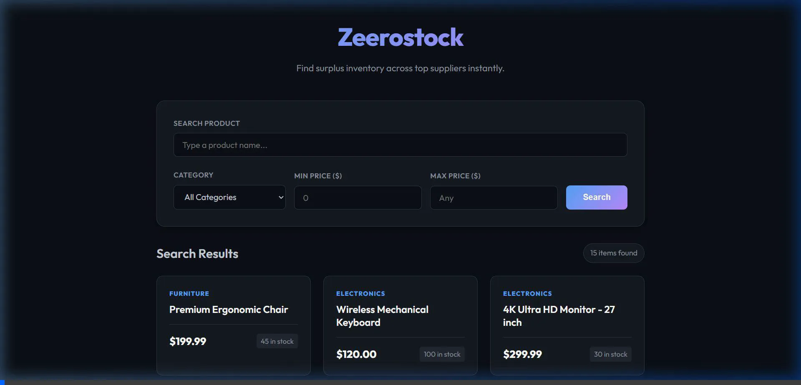
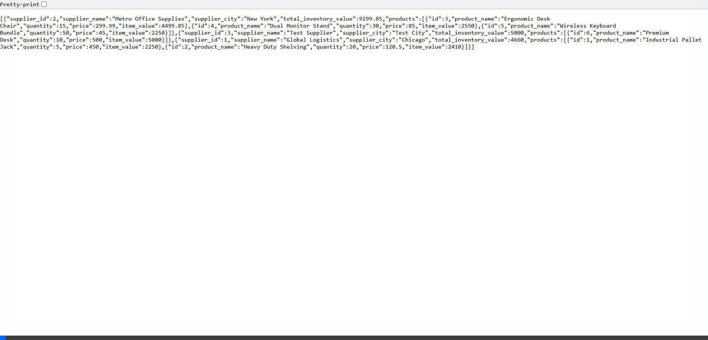

# ZeeroStock Assignment Walkthrough

This document provides a detailed walkthrough of the two assignments completed for the ZeeroStock software engineering assessment.

## Assignment A: Inventory Search UI

Assignment A focuses on a high-performance, dark-mode search interface for surplus inventory. It features multi-filter chaining with real-time updates (via server requests).

### Demo: Inventory Search
This video demonstrates searching for "Chair", filtering by the "Furniture" category, and setting a minimum price of $200.

**Key Features Shown:**
- **Asynchronous Search**: Queries are processed dynamically.
- **Filter Chaining**: Criteria for name, category, and price range are combined on the backend.
- **Premium UI**: Custom-built Vanilla CSS dark mode.

---

## Assignment B: Inventory Database + Grouped APIs

Assignment B demonstrates backend architectural rigor using a relational SQLite database. The core feature is a complex SQL aggregation that groups inventory by supplier and calculates the total valuation on-the-fly.

### Demo: Zeerostock Search Flow
This video shows the JSON response from the `/api/inventory` endpoint, highlighting how the backend aggregates large datasets into structured, supplier-grouped data.

**Key Features Shown:**
- **Relational Integrity**: Foreign Keys link inventory to valid suppliers.
- **Advanced Aggregation**: SQL logic calculates `SUM(quantity * price)` grouped by supplier ID.
- **API Performance**: Validates rules (like non-negative quantity) at the application layer.

---

## How to Verify Locally

1. **Start Assignment A Server:**
   - Go to `Assignment_A` directory.
   - Run `node server.js`.
   - Visit `http://localhost:3000`.

2. **Start Assignment B Server:**
   - Go to `Assignment_B` directory.
   - Run `node server.js`.
   - Visit `http://localhost:4000/api/inventory`.

3. **Run API Validation:**
   - In `Assignment_B`, run `node test-apis.js` to see the automated test suite in action.

> [!TIP]
> Both servers use lightweight Node.js/Express with zero external database dependencies (SQLite is self-contained), making them extremely easy to deploy and test in any environment.
